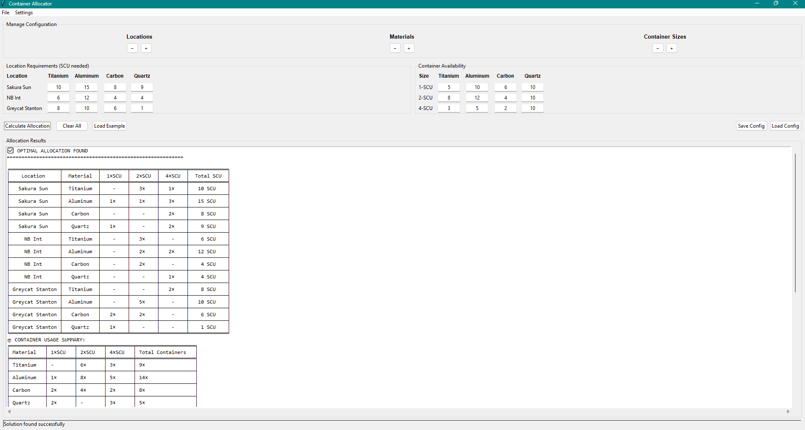

# Container Allocator

[](https://github.com/YOUR_USERNAME/container-allocator/releases)
[](https://python.org)
[](LICENSE)

A professional GUI application for optimizing container allocation across multiple locations using linear programming. **Originally created to solve the complex multi-location delivery optimization problem in Star Citizen**, but applicable to any logistics, inventory management, and resource optimization scenarios.



## The Problem This Solves

### Star Citizen Multi-Location Deliveries
In Star Citizen, member missions often ask you to deliver cargo to multiple locations (e.g., "deliver X SCU to locations A, B, and C"). However, **the game doesn't tell you the exact amounts required for each location** - you're given more containers than needed and must figure out the optimal distribution yourself.

**The Challenge:**
- You have mixed container sizes (1, 2, and 4 SCU)
- Multiple delivery locations with unknown individual requirements
- Need to minimize total containers used for efficient cargo hold management
- Manual calculation is time-consuming and error-prone

**Example Mission:**
- **Mission**: Deliver Aluminum to 3 locations (total: 22 SCU needed)
- **Given**: 5×1SCU + 5×2SCU + 7×4SCU containers (43 SCU total)
- **Problem**: Which containers go where for optimal efficiency?
- **Solution**: This app finds the mathematically optimal allocation using only 8 containers!

### Real-World Applications
While born from Star Citizen gameplay, this tool is valuable for:
- **Logistics Planning**: Warehouse distribution optimization
- **Inventory Management**: Efficient container allocation
- **Supply Chain**: Multi-location delivery planning
- **Manufacturing**: Material distribution across facilities
- **Academic Research**: Operations research and optimization studies

## Features

- **🎯 Optimal Allocation**: Uses linear programming (PuLP + CBC solver) for mathematically optimal solutions
- **📍 Multi-Location Support**: Distribute containers across unlimited locations
- **🧪 Multi-Material Handling**: Support for different material types (Aluminum, Titanium, Carbon, etc.)
- **📦 Container Size Optimization**: Works with 1, 2, and 4 SCU container sizes (or any custom sizes)
- **💾 Configuration Management**: Save and load scenarios with simple dialogs
- **📊 Professional Reports**: Three detailed tables showing allocation, usage summary, and efficiency
- **⚙️ Settings System**: Persistent configuration folder setup
- **🚀 Ready-to-Run**: Single executable, no installation required

## Quick Start

### For End Users

1. **Download** the latest `ContainerAllocator.exe` from [Releases](https://github.com/YOUR_USERNAME/container-allocator/releases)
2. **Run** the executable (no installation needed)
3. **Set up** configuration folder: Settings → Setup Config Folder
4. **Add materials** and locations using the interface
5. **Enter requirements** and available containers
6. **Calculate** to find optimal allocation

### Star Citizen Example

**Mission Scenario**: Multi-location delivery mission
- **Locations**: Port Olisar, Lorville, Area18
- **Material**: Aluminum (total needed: 22 SCU)
- **Available**: 5×1SCU + 5×2SCU + 7×4SCU containers

**Setup in App**:
1. Add material: "Aluminum"
2. Add locations: "Port Olisar", "Lorville", "Area18"
3. Enter requirements: 7 SCU, 8 SCU, 7 SCU respectively
4. Enter available containers: 5×1SCU, 5×2SCU, 7×4SCU
5. Click "Calculate"

**Result**: Optimal allocation using only 8 containers instead of guessing!

## Output Tables

### 1. Main Allocation Table
Shows exactly which containers go to each location:
```
╒═════════════╤══════════╤═══════╤═══════╤═══════╤═══════════╕
│ Location    │ Material │ 1×SCU │ 2×SCU │ 4×SCU │ Total SCU │
╞═════════════╪══════════╪═══════╪═══════╪═══════╪═══════════╡
│ Port Olisar │ Aluminum │  1×   │  1×   │  1×   │  7 SCU    │
│ Lorville    │ Aluminum │  -    │  -    │  2×   │  8 SCU    │
│ Area18      │ Aluminum │  1×   │  1×   │  1×   │  7 SCU    │
╘═════════════╧══════════╧═══════╧═══════╧═══════╧═══════════╛
```

### 2. Container Usage Summary
Shows total containers used by material and size:
```
╒══════════╤═══════╤═══════╤═══════╤═══════════════════╕
│ Material │ 1×SCU │ 2×SCU │ 4×SCU │ Total Containers  │
╞══════════╪═══════╪═══════╪═══════╪═══════════════════╡
│ Aluminum │  2×   │  2×   │  4×   │        8×         │
╘══════════╧═══════╧═══════╧═══════╧═══════════════════╛
```

### 3. Container Utilization Analysis
Shows efficiency of container usage:
```
╒══════════╤══════╤═══════════╤══════╤═══════════╤═════════════╕
│ Material │ Size │ Available │ Used │ Remaining │ Usage %     │
╞══════════╪══════╪═══════════╪══════╪═══════════╪═════════════╡
│ Aluminum │ 1×SCU│    5×     │  2×  │    3×     │ 40% (USED)  │
│ Aluminum │ 2×SCU│    5×     │  2×  │    3×     │ 40% (USED)  │
│ Aluminum │ 4×SCU│    7×     │  4×  │    3×     │ 57% (USED)  │
╘══════════╧══════╧═══════════╧══════╧═══════════╧═════════════╛
```

**Perfect for Star Citizen players!** Know exactly which containers to load and where to deliver them.

## Installation & Development

### Prerequisites
- Python 3.13 or higher
- Windows, macOS, or Linux

### Development Setup
```bash
# Clone the repository
git clone https://github.com/YOUR_USERNAME/container-allocator.git
cd container-allocator

# Create virtual environment
python -m venv .venv

# Activate virtual environment
# Windows:
.venv\Scripts\activate
# macOS/Linux:
source .venv/bin/activate

# Install dependencies
pip install -r requirements.txt

# Run from source
python src/main.py
```

### Building Executable
```bash
# Build standalone executable
pyinstaller build-tools/ContainerAllocator.spec

# Executable will be in dist/ContainerAllocator.exe
```

## Configuration Management

The application includes a streamlined configuration system perfect for saving different mission scenarios:

- **Save**: Simple text input - just enter a name like "Crusader_Aluminum_Run"
- **Load**: File list showing all saved configurations with timestamps
- **Settings**: Persistent configuration folder that remembers your choice
- **First-time setup**: Guided folder creation when needed

## Technical Details

- **Optimization Engine**: PuLP library with CBC solver for guaranteed optimal solutions
- **GUI Framework**: Tkinter with professional styling
- **Data Format**: JSON configuration files
- **Packaging**: PyInstaller for cross-platform executables
- **Architecture**: Modular design with separate solver, UI, and settings components

## Use Cases

### Gaming
- **Star Citizen**: Multi-location delivery mission optimization
- **Elite Dangerous**: Trade route cargo planning
- **EVE Online**: Industrial logistics optimization

### Real-World Applications
- **Logistics Planning**: Warehouse distribution optimization
- **Inventory Management**: Efficient container allocation
- **Supply Chain**: Multi-location delivery planning
- **Manufacturing**: Material distribution across facilities
- **Academic Research**: Operations research and optimization studies

## Contributing

Contributions are welcome! Whether you're a Star Citizen player with ideas for gaming-specific features or a logistics professional with real-world optimization needs, we'd love your input.

### Development Guidelines
- Follow PEP 8 style guidelines
- Add tests for new features
- Update documentation as needed
- Ensure cross-platform compatibility

## License

This project is licensed under the MIT License - see the [LICENSE](LICENSE) file for details.

## Support

- **Issues**: Report bugs or request features via [GitHub Issues](https://github.com/YOUR_USERNAME/container-allocator/issues)
- **Star Citizen Community**: Share your optimization results and mission strategies
- **Documentation**: See the `docs/` folder for detailed guides
- **Examples**: Check the `examples/` folder for sample configurations

## Acknowledgments

- **Inspiration**: Star Citizen's complex multi-location delivery missions
- **Optimization**: Built with [PuLP](https://github.com/coin-or/pulp) for linear programming
- **Solver**: Uses [CBC](https://github.com/coin-or/Cbc) for mathematical optimization
- **Formatting**: [Tabulate](https://github.com/astanin/python-tabulate) for professional table display
- **Community**: Star Citizen players who face the same logistics challenges

---

**Born from Star Citizen, built for everyone. Optimize your deliveries! 🚀**
